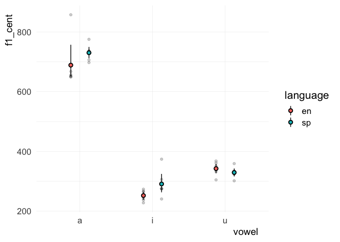
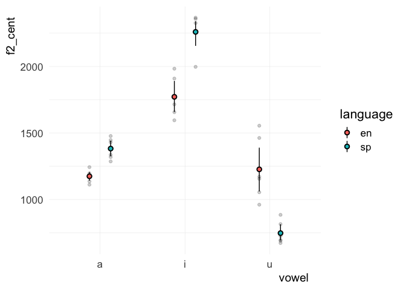
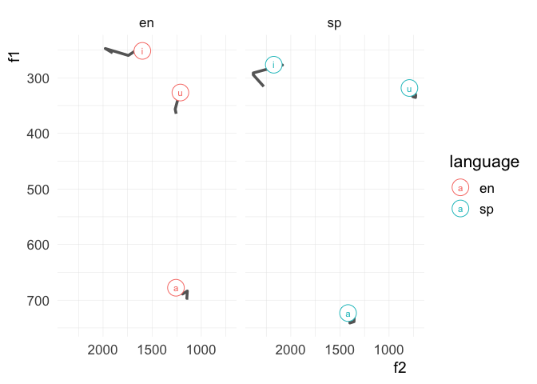

## Load libraries and data

``` r
library("tidyverse")
```

``` r
vowels <- read_csv("./data/vowel_data.csv")
```

    ## Parsed with column specification:
    ## cols(
    ##   id = col_character(),
    ##   item = col_character(),
    ##   vowel = col_character(),
    ##   language = col_character(),
    ##   f1_cent = col_double(),
    ##   f2_cent = col_double(),
    ##   tl = col_double(),
    ##   f1_20 = col_double(),
    ##   f1_35 = col_double(),
    ##   f1_50 = col_double(),
    ##   f1_65 = col_double(),
    ##   f1_80 = col_double(),
    ##   f2_20 = col_double(),
    ##   f2_35 = col_double(),
    ##   f2_50 = col_double(),
    ##   f2_65 = col_double(),
    ##   f2_80 = col_double()
    ## )

## Descriptive statistics

``` r
# Calculate means and standard deviations of your English/Spanish vowels ------
vowels %>% 
  group_by(vowel, language) %>% 
  summarize(f1_mean = mean(f1_cent), f1_sd = sd(f1_cent),
            f2_mean = mean(f2_cent), f2_sd = sd(f2_cent)) %>% 
  ungroup() %>% 
  mutate_if(is.numeric, round, digits = 2) %>% 
  mutate(f1 = paste0(f1_mean, " (", f1_sd, ")"), 
         f2 = paste0(f2_mean, " (", f2_sd, ")")) %>% 
  select(vowel, language, f1, f2) %>% 
  knitr::kable(format = "html")
```

<table>

<thead>

<tr>

<th style="text-align:left;">

vowel

</th>

<th style="text-align:left;">

language

</th>

<th style="text-align:left;">

f1

</th>

<th style="text-align:left;">

f2

</th>

</tr>

</thead>

<tbody>

<tr>

<td style="text-align:left;">

a

</td>

<td style="text-align:left;">

en

</td>

<td style="text-align:left;">

688.71 (82.89)

</td>

<td style="text-align:left;">

1174.28 (46.29)

</td>

</tr>

<tr>

<td style="text-align:left;">

a

</td>

<td style="text-align:left;">

sp

</td>

<td style="text-align:left;">

730.23 (27.37)

</td>

<td style="text-align:left;">

1382.37 (78.55)

</td>

</tr>

<tr>

<td style="text-align:left;">

i

</td>

<td style="text-align:left;">

en

</td>

<td style="text-align:left;">

252.28 (18.56)

</td>

<td style="text-align:left;">

1771.66 (149.25)

</td>

</tr>

<tr>

<td style="text-align:left;">

i

</td>

<td style="text-align:left;">

sp

</td>

<td style="text-align:left;">

291.06 (45.59)

</td>

<td style="text-align:left;">

2259.69 (137.41)

</td>

</tr>

<tr>

<td style="text-align:left;">

u

</td>

<td style="text-align:left;">

en

</td>

<td style="text-align:left;">

342.52 (22.93)

</td>

<td style="text-align:left;">

1226.27 (233.17)

</td>

</tr>

<tr>

<td style="text-align:left;">

u

</td>

<td style="text-align:left;">

sp

</td>

<td style="text-align:left;">

329.48 (18.68)

</td>

<td style="text-align:left;">

746.75 (84.26)

</td>

</tr>

</tbody>

</table>

## Plots

``` r
# 1. Plot trajectory length as a function of vowel and language ---------------
vowels %>% 
  ggplot(., aes(x = vowel, y = tl, fill = language)) + 
    stat_summary(fun.data = mean_cl_boot, geom = "pointrange", color = "grey40", 
                 position = position_dodge(0.5), pch = 21) + 
    scale_fill_viridis_d(option = "C") + 
    coord_cartesian(ylim = c(0, 1200)) + 
    labs(title = "Formant movement", 
         subtitle = "Trajectory length for Spanish/English cardinal vowels", 
         y = "Trajectory length (hz)", x = NULL, 
         caption = "Mean +/- 95% CI") + 
    theme_minimal()
```

<!-- -->

``` r
# -----------------------------------------------------------------------------
```

``` r
# 2. Plot F1 as a function of vowel and language ------------------------------
vowels %>% 
  ggplot(., aes(x = vowel, y = f1_cent, fill = language)) + 
    geom_point(position = position_dodge(0.5), alpha = 0.2) + 
    stat_summary(fun.data = mean_cl_boot, geom = "pointrange", 
                 position = position_dodge(0.5), pch = 21)
```

<!-- -->

``` r
# -----------------------------------------------------------------------------
```

``` r
# 3. Plot F2 as a function of vowel and language ------------------------------
vowels %>% 
  ggplot(., aes(x = vowel, y = f2_cent, fill = language)) + 
    geom_point(position = position_dodge(0.5), alpha = 0.2) + 
    stat_summary(fun.data = mean_cl_boot, geom = "pointrange", 
                 position = position_dodge(0.5), pch = 21)
```

<!-- -->

``` r
# -----------------------------------------------------------------------------
```

## Challenge (bonus points)

``` r
# Plot trajectory length in the F1/F2 vowel space -----------------------------

#
# Hints: 
# You will need to do some intense data manipulations first
# Check the help files for pivot_longer (?pivot_longer)
# You will need a combination of group_by, summarize, and pivot_longer 
# (in that order)
#

long_trajectories <- vowels %>% 
  group_by(vowel, language) %>% 
  summarize(f1_20 = mean(f1_20), 
            f1_35 = mean(f1_35), 
            f1_50 = mean(f1_50), 
            f1_65 = mean(f1_65), 
            f1_80 = mean(f1_80), 
            f2_20 = mean(f2_20), 
            f2_35 = mean(f2_35), 
            f2_50 = mean(f2_50), 
            f2_65 = mean(f2_65), 
            f2_80 = mean(f2_80)) %>% 
  pivot_longer(
    cols = starts_with("f"), 
    names_to = c(".value", "perc"), 
    names_sep = "_")

end_point <- long_trajectories %>% 
  filter(perc == 80)

long_trajectories %>% 
  ggplot(., aes(x = f2, y = f1, color = language, group = vowel)) + 
    facet_grid(. ~ language) + 
    geom_path(color = "grey40", size = 1.25) + 
    geom_point(data = end_point, pch = 21, size = 7, fill = "white") + 
    geom_text(data = end_point, aes(label = vowel), size = 3) + 
    scale_y_reverse() + 
    scale_x_reverse() + 
    theme_minimal()
```

<!-- -->

``` r
# -----------------------------------------------------------------------------
```

## FREEBIE

``` r
# Plot both vowel spaces together ---------------------------------------------

vowel_means <- vowels %>% 
  group_by(vowel, language) %>% 
  summarize(f1_cent = mean(f1_cent), f2_cent = mean(f2_cent)) %>% 
  ungroup() %>% 
  mutate(order = case_when(vowel == "i" ~ 1, vowel == "a" ~ 2, TRUE ~ 3), 
         vowel = forcats::fct_reorder2(vowel, vowel, order)) %>% 
  arrange(order)

vowels %>% 
  mutate(vowel = forcats::fct_relevel(vowel, "u", "a", "i")) %>% 
  ggplot(., aes(x = f2_cent, y = f1_cent, color = language, label = vowel)) + 
    geom_text(size = 3.5, alpha = 0.6, show.legend = F) + 
    geom_path(data = vowel_means, aes(group = language, lty = language), 
              color = "grey") + 
    geom_text(data = vowel_means, show.legend = F, size = 7) + 
    scale_y_reverse() + 
    scale_x_reverse() + 
    scale_color_brewer(palette = "Set1") + 
    labs(title = "Vowel space comparison", 
         subtitle = "Spectral centroids of English/Spanish cardinal vowels", 
         y = "F1 (hz)", x = "F2 (hz)") + 
    theme_minimal(base_size = 16)
```


``` r
# -----------------------------------------------------------------------------
```
